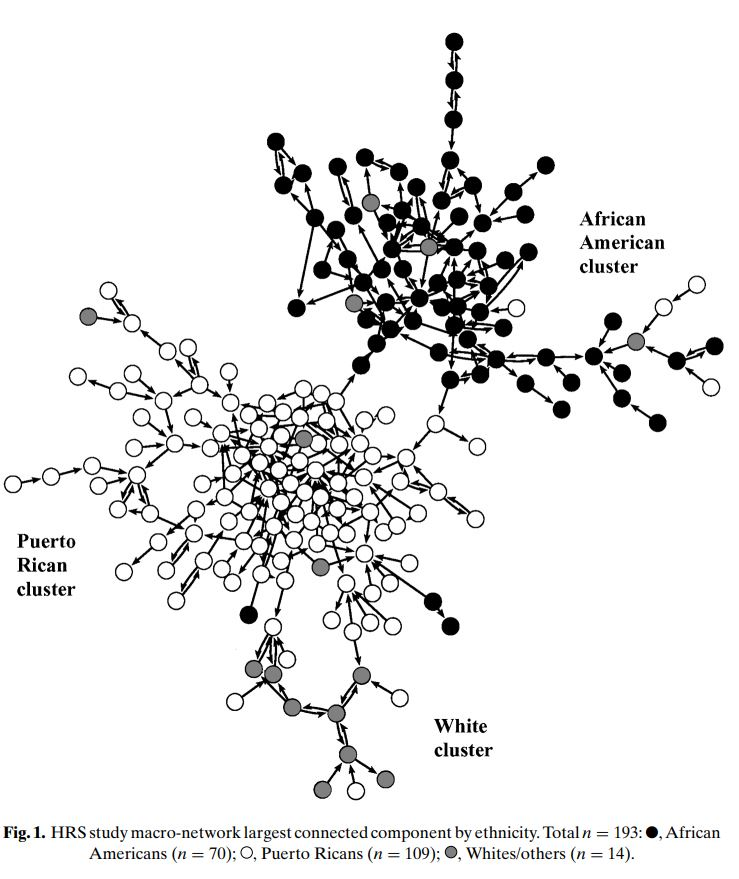
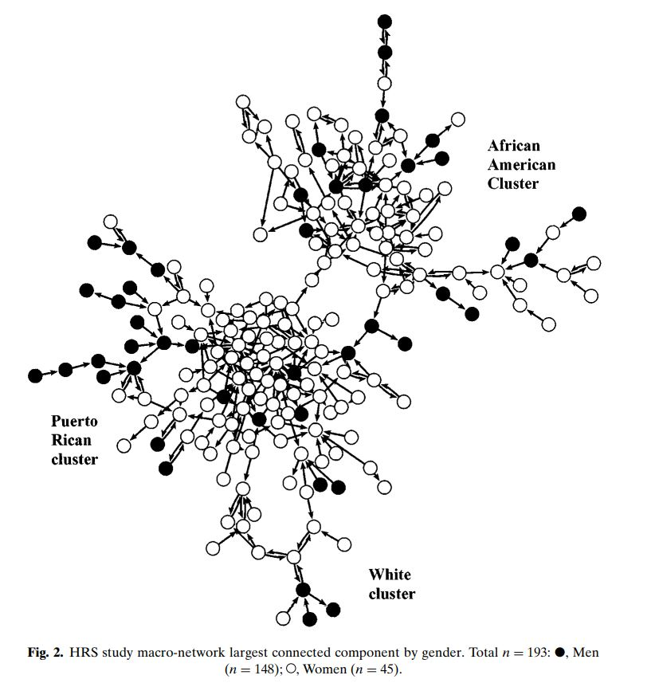

```{r setup, include=FALSE}
knitr::opts_chunk$set(echo = TRUE, message=FALSE, warning=FALSE)
knitr::opts_knit$set(root.dir = "C:/Users/jhony/Google Drive/Universidades/University of Chicago/Courses/3. Spring Quarter/Social Network Analysis/Final project/Paper")

```

\justifying

## Background: original study

@weeks2002 used social network analysis "*to explore the relationships
and interactions of drug users in settings in which potential risk
occurs, and to assess the opportunity to create prevention linkages*"
(page 193).

They sampled 293 drug-users in high-risk sites in Hartford, Connecticut,
between 1998 and 1999. 55% were recruited through community outreach
targeting neighborhoods with high drug presence. The remaining 45%
through a respondent-driven sampling process which consisted on using
monetary incentives to motivate the already-sampled individuals to
invite other familiar people to the study. Every participant had to
comply with the two following eligibility criteria: being at least 18
years-old and having actively consumed a hard drug (such as heroin,
cocaine, or crack) during the 30 days before the study began.

The authors combined an ethnographic approach with epidemiological and
social surveys to gather information about each participant and their
network. The epidemiological sections asked for factors such as drug
use, HIV status, risky practices, among others. Meanwhile, the social
network part emphasized on personal characteristics of the alter nodes
(e.g. whether they are also drug users) and information about the ties
(like the duration and strength of the relationship and frequency of
interaction). Ties were limited to people with whom participants had at
least one interaction during the past six months, and respondents could
include in their networks up to a total of 16 alters. It was intended in
the study that each participant answered the survey three times in a
six-month period.

This research performed two main approaches. First, the authors
undertook an ego-network comparison to observe if there were differences
on individuals' networks composition and dynamics based on the
ego-nodes' ethnicity (African American, Puerto Rican, and White) and
sex. In this analysis, each unit was a network and comparisons consisted
on conventional mean or proportion subgroup differences on relevant
variables such as network size, the prevalance of drug users, and tie
strength. Secondly, they moved to a whole-network analysis to analyze
the presence of clusters based on the same two characteristics
(ethnicity and sex) using visual representations of the network. They
limited this exercise to the largest component of a network conformed
only by those individuals who were sampled to participate in the study,
leading to the inclusion of 193 out of the 293 respondents. It is worth
pointing out that ties among study participants were verified by the
research team through ethnographic field observations and interviews.

Through these analyses, the authors found that both ethnicity and sex
seemed to be relevant factors for network composition and dynamics. For
instance, African American ego-networks were, on average, larger (both
overall and only considering drug users) and have older ties than Puerto
Ricans. Nevertheless, Puerto Rican networks were stronger and had a
higher frequency of interaction. Additionally, the network visualization
allowed to observe three clearly defined clusters based on ethnicity,
meaning that drug users had very low levels of interactions with others
outside their ethnic group. Besides, a second visualization based on sex
suggested that men have, on average, much higher levels of centrality
than women, who tended more to be in the peripheries of the
sub-networks. Figures 1 and 2 show the authors' results using their
original figures.

## The paper

### Motivation

Based on their results, @weeks2002 claimed the following: "*with
knowledge of social ties and structural linkages among drug users, we
can begin to move beyond individual-centered, behavioristic explanations
of HIV risk, transmission, prevalence, and formulas for prevention*"
(page 204). What the authors referred to with this indication is that
social structures matter and should be considered when designing
interventions aiming to overcome a social problem, whether it is HIV
transmission, drug use, or any other. Therefore, generating evidence
over networks and social structures related to drug use in settings
similar to that studied by these authors might contribute to the policy
debate around this topic and move away from "one-size-fits-all"
interventions.

Nevertheless, it is not the intention of this final paper to come with
an accurate description about the most relevant factors affecting how
drug users interact with each other and form networks.

\newpage

```{r fig1, echo=FALSE, out.width="40%", fig.align="top", fig.cap="\\label{fig:fig1}\t{Ethnicity-based clustering in drug users network}"}


```

\centering

**Source:** Figure 1 from @weeks2002 (page 200)

```{r fig2, echo=FALSE, out.width="40%", fig.align="bottom", fig.cap="\\label{fig:fig2}\t{Location of men and women in drug users network}"}


```

**Source:** Figure 2 from @weeks2002 (page 201)

\justifying

\newpage

Our intention is by far more simple: just to keep emphasizing that we as
social scientists, policy analysts and policymakers must always remember
that human experiences are shaped by contexts and contexts can differ
between groups based on their characteristics.

Finally, in the particular case of sex and ethnicity, generating more
evidence about their relationships in drug user networks can also
motivate further and deeper research other this topic with the aim of
understanding better the mechanisms through which such characteristics
can end up affecting the way individuals experience their drug
use-related reality.

### Data

This work uses a dataset from @morris2011, which contains several
high-risk drug user networks between 1997 and 2001 in different places
in the United States. The following table details the networks included
in this paper.[^1]

[^1]: We excluded one setting because it was located outside the United
    States: Manitoba, Canada.

+------------------------+-----------+---------------+
| Setting                | Number of | Ego-nodes     |
|                        | ego-nodes | with          |
|                        |           | drug-related  |
|                        |           | ties          |
+:======================:+:=========:+:=============:+
| Atlanta Antiviral      | 358       | 216           |
+------------------------+-----------+---------------+
| Atlanta Urban          | 228       | 210           |
+------------------------+-----------+---------------+
| Baltimore              | 1,667     | 1,371         |
+------------------------+-----------+---------------+
| Brooklyn               | 703       | 312           |
+------------------------+-----------+---------------+
| Colorado Springs       | 591       | 440           |
+------------------------+-----------+---------------+
| Flagstaff Rural        | 88        | 69            |
| (Arizona)              |           |               |
+------------------------+-----------+---------------+
| Houston                | 295       | 237           |
+------------------------+-----------+---------------+
| Total number of        | 3,923     | 2,855         |
| ego-nodes              |           |               |
+------------------------+-----------+---------------+

: Drug user networks analyzed in this paper

**Note:** this paper uses the number of ego-nodes displayed in the third
column. **Source:** @morris2011 except the third column, which is based
on own calculations

\justifying

Each setting is represented by an edge list connecting each ego-node to
the alters he or she included as part of their network. We kept the
following information in every setting:

-   [Ego-node ethinicity]{.ul}: we defined the following categories
    based on the data

    -   African American: those who identified their race as "Black" and
        their ethnicity as "Non-hispanic"

    -   White: those those who identified their race as "White" and
        their ethnicity as "Non-hispanic"

    -   Latino/hispanic: those who identified their ethnicity as
        "Hispanic", regardless of their race

    -   Others: those who did not identified their race as "White" or
        "Black" and identified their ethnicity as "Non-hispanic"

-   [Ego-node sex]{.ul}: male or female

-   [Type of tie]{.ul}: sexual, social, drug use, or others. The drug
    use category was further divided into "needle sharing" and "other
    drugs".

Additionally, any tie can appear more than once in a setting based on
the following conditions:

-   [Number of interviews]{.ul}: being all settings part of longitudinal
    studies, each ego-node may have been interviewed more than once

-   [Type of relationship]{.ul}: an ego and alter node may have shared
    more than one type of relationship (e.g. both a drug and social
    relationship during the same period)

There were other variables that would have been informative for this
paper. However, they were discarded for not being available in every
setting.[^2]

[^2]: For instance, some settings gathered information about employment
    status, occupational prestige and activities, and educational
    attainment of ego and alter nodes.

### Analytical strategy

This paper follows the methodological approach used by @weeks2002. We
used as inputs the data sets harmonized by @morris2011 to construct a
separate set of ego-networks and a whole-networks in each setting.

We constructed ego-networks by aggregating the information related to
the ties held by each respondent, so that each observation corresponded
to an ego-node. Considering the objective of this paper, the samples in
each setting only included those respondents with at least one
drug-related tie (see third column of Table 1). Afterwards, we performed
sub-groups mean comparisons based on ethnicity and sex in each setting
using t-tests to calculate the statistical significance of the
differences. Then, we generated one whole-network for each setting using
the ties among the study participants and plotted the largest
component(s). We discarded ties that included alters that were not part
of the sample because not all settings gathered race and ethnic
information from those individuals. Thus, we only have this information
for the ego-based nodes.

When performing analysis based on ethnicity, we dropped the information
related to other ethnicities different from White, African American, and
Hispanic. This decision answered to the fact that, in contrast to
@weeks2002, our data sets included other minority ethnic groups such as
Native Americans and Asians. Including these groups would have hindered
the analysis because they do not appear in every setting and are
considerably underrepresented in some of the settings in which they are
included. Moreover, aggregating them in a category such as "Others"
would have not added value to this work because each group might have
probably different dynamics. Thus, it would have been afterwards
difficult interpreting the results of such a category. Such exclusions
are not performed on analysis based on sex.

### Results

#### Ethnic-based differences in the composition of ego-networks

Table \@ref(tab:ethnsize) shows the results of the mean differences on
network size. We can observe the average network size was normally above
10 people except in the case of Houston and Brooklyn. The notoriously
smaller sizes in this last setting might suggest that these participants
may not be that comparable to the rest. The other settings, including
Houston, showed average ego-networks larger than those reported by
@weeks2002.[^3] There is no clear pattern emerging about network size
and few significant differences. For instance, while African Americans
and Hispanics had, on average, a higher network size than Whites in
Baltimore, the opposite happens in Urban Atlanta and Flagstaff. Perhaps
what seems to be more consistent is the fact that differences between
African Americans and Hispanics are commonly smaller.

[^3]: Those authors reported an average network size of 7.4 for African
    Americans and 4.4 for Puerto Ricans

Differences regarding the prevalence of drug users in ego-networks are
displayed in Table \@ref(tab:ethdrug). The average respondent in all
settings held a proportion of drug-related relationships considerably
lower than those observed in @weeks2002 (which were between 80% and
88%). In this sense, the respondents belonging to that work might have
been potentially exposed to more risks related to drug use since their
networks were mostly composed by other drug users. This table also shows
small ethnic-based differences in drug-related ties with the exceptions
of larger negative differences for African American in Baltimore. It is
worth mentioning that although Hispanics had a much lower share of drug
user in their networks in Atlanta Antiviral, this results should be
interpreted cautiously given that the number of Hispanics in this
setting was very low. Therefore, it seems that in these settings
ethnicity was less of a relevant factor for explaining differences in
maintaining drug-related ties.

```{r ego_ethnic, echo=FALSE}

path_data <- "C:/Users/jhony/Google Drive/Universidades/University of Chicago/Courses/3. Spring Quarter/Social Network Analysis/Final project/Paper/Data/3_Outputs" 

library(haven)
library(tidyverse)
library(stargazer)

# Importing ego network data frame. See the Stata do-file (script) "0_construct_ego_network" (included in Canvas) for details about the initial data cleaning and management process that was followed to transform the raw edgelist data frame into this. 

ego_network_df <- read_dta(paste0(path_data,"/ego_network.dta"))

# Setting ethnicity and sex as categorical (factor) variables
ego_network_df <- ego_network_df %>% 
  mutate(ego_ethnicity = relevel(as.factor(ego_ethnicity), ref = "White"),
         ego_female = as.factor(ego_female), ref = "Male")

settings = unique(ego_network_df$studynum)

# Generate results: ethnicity-network size
for (place in settings){
  name <- paste("result_eth_nsize",place, sep = "_")
  assign(name, lm(network_size ~ ego_ethnicity,
                  data = ego_network_df %>% 
                    filter(studynum == place & ego_ethnicity != "Others" )))
} 

# Generate results: ethnicity-predominance of drug-related ties
for (place in settings){
  name <- paste("result_eth_drug",place, sep = "_")
  assign(name, lm(tie_drug ~ ego_ethnicity,
                  data = ego_network_df %>% 
                    filter(studynum == place & ego_ethnicity != "Others")))
} 

# Generate results: ethnicity-predominance of needle-sharing ties
for (place in settings){
  name <- paste("result_eth_needle",place, sep = "_")
  assign(name, lm(tie_needle ~ ego_ethnicity,
                  data = ego_network_df %>% 
                    filter(studynum == place & ego_ethnicity != "Others")))
}

# Generate results: ethnicity-predominance of sexual ties
for (place in settings){
  name <- paste("result_eth_sex",place, sep = "_")
  assign(name, lm(tie_sexual ~ ego_ethnicity,
                  data = ego_network_df %>% 
                    filter(studynum == place & ego_ethnicity != "Others")))
}
```

```{r eth_net_size, echo=FALSE, results = "asis"}
stargazer(`result_eth_nsize_Atlanta (Antiviral)`, 
          `result_eth_nsize_Atlanta (Urban)`,
          result_eth_nsize_Baltimore,
          result_eth_nsize_Brooklyn,
          `result_eth_nsize_Colorado Springs`,
          `result_eth_nsize_Flagstaff (Arizona)`,
          result_eth_nsize_Houston,
          type = 'latex',
          intercept.bottom = TRUE,
          single.row = FALSE,
          column.sep.width = "1pt",
          no.space = TRUE, 
          header=FALSE,
          title = "Ethnicity-based differences in mean network size",
          covariate.labels = c("African American",
                               "Hispanic"
                               ),
          column.labels = c("\\shortstack{Atlanta\\\\(Antiviral)}",
                             "\\shortstack{Atlanta\\\\(Urban)}",
                             "Baltimore",
                             "Brooklyn",
                             "\\shortstack{Colorado\\\\Springs}",
                             "\\shortstack{Flagstaff\\\\(AZ)}",
                             "Houston"
                             ),
          dep.var.caption = "",
          dep.var.labels.include = FALSE,
          notes = c("Groups' coefficients show mean differences with respect to the 'White' group (whose",
                    "mean value is reflected in the constant term). $^{*}p<0.1, ^{**}p<0.05, ^{***}p<0.01$."),
          notes.append = FALSE,
          notes.align = "l",
          df = FALSE,
          omit.stat = c("aic", "ll", "sigma2", "lr", "wald", "rsq", 
                        "adj.rsq", "ser"),
          table.placement = "H",
          label = "tab:ethnsize")
```

```{r eth_drug, echo=FALSE, results = "asis"}
stargazer(`result_eth_drug_Atlanta (Antiviral)`, 
          `result_eth_drug_Atlanta (Urban)`,
          result_eth_drug_Baltimore,
          result_eth_drug_Brooklyn,
          `result_eth_drug_Colorado Springs`,
          `result_eth_drug_Flagstaff (Arizona)`,
          result_eth_drug_Houston,
          type = 'latex',
          intercept.bottom = TRUE,
          single.row = FALSE,
          column.sep.width = "1pt",
          no.space = TRUE, 
          header=FALSE,
          title = "Ethnicity-based differences in percentage of drug-related ties inside ego-networks",
          covariate.labels = c("African American",
                               "Hispanic"
                               ),
          column.labels = c("\\shortstack{Atlanta\\\\(Antiviral)}",
                             "\\shortstack{Atlanta\\\\(Urban)}",
                             "Baltimore",
                             "Brooklyn",
                             "\\shortstack{Colorado\\\\Springs}",
                             "\\shortstack{Flagstaff\\\\(AZ)}",
                             "Houston"
                             ),
          dep.var.caption = "",
          dep.var.labels.include = FALSE,
          notes = c("Groups' coefficients show mean differences with respect to the 'White' group (whose",
                    "mean value is reflected in the constant term). $^{*}p<0.1, ^{**}p<0.05, ^{***}p<0.01$."),
          notes.append = FALSE,
          notes.align = "l",
          df = FALSE,
          omit.stat = c("aic", "ll", "sigma2", "lr", "wald", "rsq", 
                        "adj.rsq", "ser"),
          table.placement = "H",
          label = "tab:ethdrug")
```

Table \@ref(tab:ethneedle) focuses on drug-related ties limited to
needle sharing, which is a relevant aspect considering how this activity
might create additional risks for drug users related to the potential
transmission of diseases such as HIV. This table shows several remarks.
On one side, shares differ widely across settings. For instance, both
studies in Atlanta and Flagstaff had considerably low proportions of
needle sharing (less than 4%), despite having relatively high prevalence
of drug ties. Meanwhile, Brooklyn, Baltimore, and Houston showed
remarkably greater proportions of needle sharing. Brooklyn's case is
specially worth highlighting not only because it at least almost doubled
the prevalence of the other settings, but also because most of its
drug-related ties are connected to needle sharing. Adding this point to
the starkly smaller network size observed in Table \@ref(tab:ethnsize)
helps build the case that Brooklyn's study might have targeted a
different type of people in comparison to the other settings.

We can also appreciate from this table that, in comparison to other
groups, African Americans seem to have a lower propensity to engage in
(or at least report) needle sharing activities in settings with
relatively high prevalence of such ties except in the case of Brooklyn.
Moreover, their shares are 5% or lower in all settings except Baltimore
and Brooklyn. Therefore, their drug-related problems seem to be in most
caes concentrated in other drugs. In contrast, this is not true for
Hispanics and Whites. In places where needle sharing was more common,
their proportions where significantly higher and similar to each other.

```{r eth_needle, echo=FALSE, results = "asis"}
stargazer(`result_eth_needle_Atlanta (Antiviral)`, 
          `result_eth_needle_Atlanta (Urban)`,
          result_eth_needle_Baltimore,
          result_eth_needle_Brooklyn,
          `result_eth_needle_Colorado Springs`,
          `result_eth_needle_Flagstaff (Arizona)`,
          result_eth_needle_Houston,
          type = 'latex',
          intercept.bottom = TRUE,
          single.row = FALSE,
          column.sep.width = "1pt",
          no.space = TRUE, 
          header=FALSE,
          title = "Ethnicity-based differences in percentage of needle-sharing ties inside ego-networks",
          covariate.labels = c("African American",
                               "Hispanic",
                               "Others"
                               ),
          column.labels = c("\\shortstack{Atlanta\\\\(Antiviral)}",
                             "\\shortstack{Atlanta\\\\(Urban)}",
                             "Baltimore",
                             "Brooklyn",
                             "\\shortstack{Colorado\\\\Springs}",
                             "\\shortstack{Flagstaff\\\\(AZ)}",
                             "Houston"
                             ),
          dep.var.caption = "",
          dep.var.labels.include = FALSE,
          notes = c("Groups' coefficients show mean differences with respect to the 'White' group (whose",
                    "mean value is reflected in the constant term). $^{*}p<0.1, ^{**}p<0.05, ^{***}p<0.01$."),
          notes.append = FALSE,
          notes.align = "l",
          df = FALSE,
          omit.stat = c("aic", "ll", "sigma2", "lr", "wald", "rsq", 
                        "adj.rsq", "ser"),
          table.placement = "H",
          label = "tab:ethneedle")
```

Finally, \@ref(tab:ethsex) displays differences in the proportion of
sexual ties. Looking at this type of ties is also important because,
like needle sharing, they are also related to higher risks of acquiring
sexual transmitted diseases. Therefore, having both high a prevalence of
needle sharing and sexual ties can suggest that individuals are exposed
to relevant levels of risk and could also act as spreaders. Once again,
we can observe heterogeneity in the prevalence of this type of tie based
on the setting being observed, with Atlanta having much higher shares
than the rest. There are no clear ethnicity-based differences except for
a couple of exceptions. African Americans have a much lower prevalence
of sexual ties in Urban Atlanta and a higher prevalence in Colorado
Springs in comparison to Whites and Hispanics. Meanwhile, Hispanics have
a lower share of such ties in Atlanta (Antiviral) and a higher
proportion in Brooklyn in comparison to Whites.

```{r eth_sex, echo=FALSE, results = "asis"}
stargazer(`result_eth_sex_Atlanta (Antiviral)`, 
          `result_eth_sex_Atlanta (Urban)`,
          result_eth_sex_Baltimore,
          result_eth_sex_Brooklyn,
          `result_eth_sex_Colorado Springs`,
          `result_eth_sex_Flagstaff (Arizona)`,
          result_eth_sex_Houston,
          type = 'latex',
          intercept.bottom = TRUE,
          single.row = FALSE,
          column.sep.width = "1pt",
          no.space = TRUE, 
          header=FALSE,
          title = "Ethnicity-based differences in percentage of sexual ties inside ego-networks",
          covariate.labels = c("African American",
                               "Hispanic",
                               "Others"
                               ),
          column.labels = c("\\shortstack{Atlanta\\\\(Antiviral)}",
                             "\\shortstack{Atlanta\\\\(Urban)}",
                             "Baltimore",
                             "Brooklyn",
                             "\\shortstack{Colorado\\\\Springs}",
                             "\\shortstack{Flagstaff\\\\(AZ)}",
                             "Houston"
                             ),
          dep.var.caption = "",
          dep.var.labels.include = FALSE,
          notes = c("Groups' coefficients show mean differences with respect to the 'White' group (whose",
                    "mean value is reflected in the constant term). $^{*}p<0.1, ^{**}p<0.05, ^{***}p<0.01$."),
          notes.append = FALSE,
          notes.align = "l",
          df = FALSE,
          omit.stat = c("aic", "ll", "sigma2", "lr", "wald", "rsq", 
                        "adj.rsq", "ser"),
          table.placement = "H",
          label = "tab:ethsex")
```

#### Sex-based differences in the composition of ego-networks

Tables \@ref(tab:sexnsize), \@ref(tab:sexdrug), \@ref(tab:sexneedle),
and \@ref(tab:sexsex) repeat the exercises focusing on sex. Like in
@weeks2002, women in these settings tend to have, on average, similar
size networks than men, with the only noteworthy difference being in
Colorado Springs, where their networks tended to be smaller.
Nevertheless, they showed consistently a larger predominance of
relationships based on drug use than men (see Table \@ref(tab:sexdrug)),
and had a statistically higher tendency to share needles in Colorado
Springs (Table \@ref(tab:sexneedle)). Finally, women showed a similar
proportion of sexual ties than men with the exception of two settings:
Brooklyn and Colorado Springs, settings in which their percentages were
smaller. It is worth mentioning that we are deliberately moving
attention away from the significant results in Baltimore because they
are being driven by a higher statistical power due to much greater
sample size than by an economically relevant magnitude of its
coefficients.

```{r ego_sex, echo=FALSE}

# Generate results: sex-network size
for (place in settings){
  name <- paste("result_sex_nsize",place, sep = "_")
  assign(name, lm(network_size ~ ego_female,
                  data = ego_network_df %>% filter(studynum == place)))
} 

# Generate results: sex-predominance of drug-relate ties
for (place in settings){
  name <- paste("result_sex_drug",place, sep = "_")
  assign(name, lm(tie_drug ~ ego_female,
                  data = ego_network_df %>% filter(studynum == place)))
} 

# Generate results: sex-predominance of needle sharing ties
for (place in settings){
  name <- paste("result_sex_needle",place, sep = "_")
  assign(name, lm(tie_needle ~ ego_female,
                  data = ego_network_df %>% filter(studynum == place)))
} 

# Generate results: sex-predominance of sex activities
for (place in settings){
  name <- paste("result_sex_sex",place, sep = "_")
  assign(name, lm(tie_sexual ~ ego_female,
                  data = ego_network_df %>% filter(studynum == place)))
} 
```

```{r sex_net_size, echo=FALSE, results = "asis"}
stargazer(`result_sex_nsize_Atlanta (Antiviral)`, 
          `result_sex_nsize_Atlanta (Urban)`,
          result_sex_nsize_Baltimore,
          result_sex_nsize_Brooklyn,
          `result_sex_nsize_Colorado Springs`,
          `result_sex_nsize_Flagstaff (Arizona)`,
          result_sex_nsize_Houston,
          type = 'latex',
          intercept.bottom = TRUE,
          single.row = FALSE,
          column.sep.width = "1pt",
          no.space = TRUE, 
          header=FALSE,
          title = "Sex-based differences in mean network size",
          covariate.labels = c("Females"
                               ),
          column.labels = c("\\shortstack{Atlanta\\\\(Antiviral)}",
                             "\\shortstack{Atlanta\\\\(Urban)}",
                             "Baltimore",
                             "Brooklyn",
                             "\\shortstack{Colorado\\\\Springs}",
                             "\\shortstack{Flagstaff\\\\(AZ)}",
                             "Houston"
                             ),
          dep.var.caption = "",
          dep.var.labels.include = FALSE,
          notes = c("Females' coefficients shows mean differences with respect to males (whose mean",
                    "(value is reflected in the constant term). $^{*}p<0.1, ^{**}p<0.05, ^{***}p<0.01$."),
          notes.append = FALSE,
          notes.align = "l",
          df = FALSE,
          omit.stat = c("aic", "ll", "sigma2", "lr", "wald", "rsq", 
                        "adj.rsq", "ser"),
          table.placement = "H",
          label = "tab:sexnsize")
```

```{r sex_net_drug, echo=FALSE, results = "asis"}
stargazer(`result_sex_drug_Atlanta (Antiviral)`, 
          `result_sex_drug_Atlanta (Urban)`,
          result_sex_drug_Baltimore,
          result_sex_drug_Brooklyn,
          `result_sex_drug_Colorado Springs`,
          `result_sex_drug_Flagstaff (Arizona)`,
          result_sex_drug_Houston,
          type = 'latex',
          intercept.bottom = TRUE,
          single.row = FALSE,
          column.sep.width = "1pt",
          no.space = TRUE, 
          header=FALSE,
          title = "Sex-based differences in percentage of drug-related ties inside ego-networks",
          covariate.labels = c("Females"
                               ),
          column.labels = c("\\shortstack{Atlanta\\\\(Antiviral)}",
                             "\\shortstack{Atlanta\\\\(Urban)}",
                             "Baltimore",
                             "Brooklyn",
                             "\\shortstack{Colorado\\\\Springs}",
                             "\\shortstack{Flagstaff\\\\(AZ)}",
                             "Houston"
                             ),
          dep.var.caption = "",
          dep.var.labels.include = FALSE,
          notes = c("Females' coefficients shows mean differences with respect to males (whose mean",
                    "(value is reflected in the constant term). $^{*}p<0.1, ^{**}p<0.05, ^{***}p<0.01$."),
          notes.append = FALSE,
          notes.align = "l",
          df = FALSE,
          omit.stat = c("aic", "ll", "sigma2", "lr", "wald", "rsq", 
                        "adj.rsq", "ser"),
          table.placement = "H",
          label = "tab:sexdrug")
```

```{r sex_net_needle, echo=FALSE, results = "asis"}
stargazer(`result_sex_needle_Atlanta (Antiviral)`, 
          `result_sex_needle_Atlanta (Urban)`,
          result_sex_needle_Baltimore,
          result_sex_needle_Brooklyn,
          `result_sex_needle_Colorado Springs`,
          `result_sex_needle_Flagstaff (Arizona)`,
          result_sex_needle_Houston,
          type = 'latex',
          intercept.bottom = TRUE,
          single.row = FALSE,
          column.sep.width = "1pt",
          no.space = TRUE, 
          header=FALSE,
          title = "Sex-based differences in percentage of needle-sharing ties inside ego-networks",
          covariate.labels = c("Females"
                               ),
          column.labels = c("\\shortstack{Atlanta\\\\(Antiviral)}",
                             "\\shortstack{Atlanta\\\\(Urban)}",
                             "Baltimore",
                             "Brooklyn",
                             "\\shortstack{Colorado\\\\Springs}",
                             "\\shortstack{Flagstaff\\\\(AZ)}",
                             "Houston"
                             ),
          dep.var.caption = "",
          dep.var.labels.include = FALSE,
          notes = c("Females' coefficients shows mean differences with respect to males (whose mean",
                    "(value is reflected in the constant term). $^{*}p<0.1, ^{**}p<0.05, ^{***}p<0.01$."),
          notes.append = FALSE,
          notes.align = "l",
          df = FALSE,
          omit.stat = c("aic", "ll", "sigma2", "lr", "wald", "rsq", 
                        "adj.rsq", "ser"),
          table.placement = "H",
          label = "tab:sexneedle")
```

```{r sex_net_sex, echo=FALSE, results = "asis"}
stargazer(`result_sex_sex_Atlanta (Antiviral)`, 
          `result_sex_sex_Atlanta (Urban)`,
          result_sex_sex_Baltimore,
          result_sex_sex_Brooklyn,
          `result_sex_sex_Colorado Springs`,
          `result_sex_sex_Flagstaff (Arizona)`,
          result_sex_sex_Houston,
          type = 'latex',
          intercept.bottom = TRUE,
          single.row = FALSE,
          column.sep.width = "1pt",
          no.space = TRUE, 
          header=FALSE,
          title = "Sex-based differences in percentage of sexual ties inside ego-networks",
          covariate.labels = c("Females"
                               ),
          column.labels = c("\\shortstack{Atlanta\\\\(Antiviral)}",
                             "\\shortstack{Atlanta\\\\(Urban)}",
                             "Baltimore",
                             "Brooklyn",
                             "\\shortstack{Colorado\\\\Springs}",
                             "\\shortstack{Flagstaff\\\\(AZ)}",
                             "Houston"
                             ),
          dep.var.caption = "",
          dep.var.labels.include = FALSE,
          notes = c("Females' coefficients shows mean differences with respect to males (whose mean",
                    "(value is reflected in the constant term). $^{*}p<0.1, ^{**}p<0.05, ^{***}p<0.01$."),
          notes.append = FALSE,
          notes.align = "l",
          df = FALSE,
          omit.stat = c("aic", "ll", "sigma2", "lr", "wald", "rsq", 
                        "adj.rsq", "ser"),
          table.placement = "H",
          label = "tab:sexsex")
```

#### Ethnic-based clustering patterns in whole-networks

Figures \@ref(fig:fig-eth-brooklyn) to \@ref(fig:fig-eth-houston)
display the largest network components of Brooklyn, Colorado Springs,
Flagstoff, and Houston.[^4] It is worth mentioning that we kept only one
component in the first three settings and five in Houston. The reason
for this decision is that Houston was the only setting that had more
than one component concentrating a relevant share of the network.[^5]

[^4]: This section excludes the Baltimore and both Atlanta settings
    because they would not have added to the analysis. Baltimore's
    network is highly disaggregated and had very few ties between
    respondents. To clarify this, Figure A1 in the appendix shows the
    components' distribution of this network. As it can be appreciated,
    the largest component had only 6 ties. On the other side, nodes
    belonging to Atlanta (Antiviral) had no ties among each other (see
    Figure A2). Finally, Atlanta (Urban)'s largest component had an
    enormous concentration of African American nodes (see Figure A3).

[^5]: In the other three cases, the number of nodes included in a
    component dropped dramatically when moving from the largest to the
    second largest component. For example, while the largest component
    in Colorado Springs included 270 nodes, the next component had
    barely 3. In contrast, Houston's largest component had 51 nodes, the
    following had 39, the third had 25, and the fourth and fifth had 9.

A general overview of the figures allows to observe some clustering
patterns related to ethnicity that are similar to those found in
@weeks2002 (see Figure \@ref(fig:fig1)). There do not seem to be three
clearly-defined clusters in Brooklyn, but several smaller clusters
instead. However, we do observe in Figure \@ref(fig:fig-eth-brooklyn)
very low between-ethnic groups interactions, especially involving White
and African Americans. These two groups are normally located at the
peripheries of the network. Hispanics, in contrast, seem to have a more
central location and higher interactions with other groups. We also
observed an ethnic concentration in Colorado Springs, with almost all
African Americans being located at the left side of the network and
Hispanics at the center (see Figure \@ref(fig:fig-eth-col-spr)).
Although there are also concentrations of almost only white people in
the right side of the network, we do observe some interaction between
White and Hispanics and Whites and African Americans. There are more
clear-cut patterns in Flagstoff (Figure \@ref(fig:fig-eth-flagstoff))
and Houston (Figure \@ref(fig:fig-eth-houston)) with most people being
almost only tied with others belonging to their own ethnicity.

```{r whole_network, echo=FALSE}

library(igraph)

# Uploading whole network data. See the Stata do-file (script) "1_construct_whole_network" (included in Canvas) for details about the initial data cleaning and management process that was followed to transform the raw edgelist data frame into this. 

whole_network_df <- read_dta(paste0(path_data,"/whole_network.dta"))

# Generating whole-network igraph objects by setting:
settings <- unique(whole_network_df$studynum)

for (place in settings){
  name <- paste("network",place, sep = "_")
  network <- whole_network_df %>% filter(studynum == place & ego_ethnicity != "Others")
  assign(name, graph_from_data_frame(network, directed = FALSE))
} 

# Suppressing bidirectional edges 
E(`network_Atlanta (Antiviral)`)$curved <- 0
E(`network_Atlanta (Urban)`)$curved <- 0
E(network_Baltimore)$curved <- 0
E(network_Brooklyn)$curved <- 0
E(`network_Colorado Springs`)$curved <- 0
E(`network_Flagstaff (Arizona)`)$curved <- 0
E(network_Houston)$curved <- 0

# Deleting a NA node that appears in each network
`network_Atlanta (Antiviral)` <- delete_vertices(`network_Atlanta (Antiviral)`, 
                                                 V(`network_Atlanta (Antiviral)`)$name=="NA")

`network_Atlanta (Urban)` <- delete_vertices(`network_Atlanta (Urban)`, 
                                              V(`network_Atlanta (Urban)`)$name=="NA")

network_Baltimore <- delete_vertices(network_Baltimore, V(network_Baltimore)$name=="NA")

network_Brooklyn <- delete_vertices(network_Brooklyn, V(network_Brooklyn)$name=="NA")

`network_Colorado Springs` <- delete_vertices(`network_Colorado Springs`, 
                                              V(`network_Colorado Springs`)$name=="NA")

`network_Flagstaff (Arizona)` <- delete_vertices(`network_Flagstaff (Arizona)`, 
                                              V(`network_Flagstaff (Arizona)`)$name=="NA")

network_Houston <- delete_vertices(network_Houston, V(network_Houston)$name=="NA")

# Adding ethnicity attribute to the nodes:
ethnicity <- whole_network_df %>% select(id1, ego_ethnicity, studynum)

ethnicity <- ethnicity[!duplicated(ethnicity), ]

for (place in settings){
  name <- paste("ethnicity",place, sep = "_")
  ethnicity_filtered <- ethnicity %>% filter(studynum == place & ego_ethnicity != "Others") %>% select(ego_ethnicity)
  assign(name, ethnicity_filtered$ego_ethnicity)
}

V(`network_Atlanta (Antiviral)`)$ethnicity <- `ethnicity_Atlanta (Antiviral)`
V(`network_Atlanta (Urban)`)$ethnicity <- `ethnicity_Atlanta (Urban)`
V(network_Baltimore)$ethnicity <- ethnicity_Baltimore
V(network_Brooklyn)$ethnicity <- ethnicity_Brooklyn
V(`network_Colorado Springs`)$ethnicity <- `ethnicity_Colorado Springs`
V(`network_Flagstaff (Arizona)`)$ethnicity <- `ethnicity_Flagstaff (Arizona)`
V(network_Houston)$ethnicity <- ethnicity_Houston

# Adding sex attribute to the nodes:
sex <- whole_network_df %>% select(id1, ego_female, studynum)

sex <- sex[!duplicated(sex), ]

for (place in settings){
  name <- paste("sex",place, sep = "_")
  sex_filtered <- sex %>% filter(studynum == place) %>% select(ego_female)
  assign(name, sex_filtered$ego_female)
}

V(`network_Atlanta (Antiviral)`)$sex <- `sex_Atlanta (Antiviral)`
V(`network_Atlanta (Urban)`)$sex <- `sex_Atlanta (Urban)`
V(network_Baltimore)$sex <- sex_Baltimore
V(network_Brooklyn)$sex <- sex_Brooklyn
V(`network_Colorado Springs`)$sex <- `sex_Colorado Springs`
V(`network_Flagstaff (Arizona)`)$sex <- `sex_Flagstaff (Arizona)`
V(network_Houston)$sex <- sex_Houston

networks <- c(`network_Atlanta (Antiviral)`, `network_Atlanta (Urban)`, network_Baltimore, network_Brooklyn, `network_Colorado Springs`, `network_Flagstaff (Arizona)`, network_Houston)

# Keeping largest component(s) of each network:
network <- `network_Atlanta (Antiviral)`
components <- components(network)
V(network)$cgroup <- components$membership
value <- components(network)$csize
component_atl_ant <- induced_subgraph(network, which(V(network)$cgroup == which(value==max(value))))

network <- `network_Atlanta (Urban)`
components <- components(network)
V(network)$cgroup <- components$membership
value <- components(network)$csize
component_atl_urb <- induced_subgraph(network, which(V(network)$cgroup == which(value==max(value))))

network <- network_Baltimore
components <- components(network)
V(network)$cgroup <- components$membership
value <- components(network)$csize
component_baltimore <- induced_subgraph(network, which(V(network)$cgroup == which(value==max(value))))

network <- network_Brooklyn
components <- components(network)
V(network)$cgroup <- components$membership
value <- components(network)$csize
component_brooklyn <- induced_subgraph(network, which(V(network)$cgroup == which(value==max(value))))

network <- `network_Colorado Springs`
components <- components(network)
V(network)$cgroup <- components$membership
value <- components(network)$csize
component_col_spr <- induced_subgraph(network, which(V(network)$cgroup == which(value==max(value))))

network <- `network_Flagstaff (Arizona)`
components <- components(network)
V(network)$cgroup <- components$membership
value <- components(network)$csize
component_flag <- induced_subgraph(network, which(V(network)$cgroup == which(value==max(value))))

network <- network_Houston
components <- components(network)
V(network)$cgroup <- components(network)$membership
value <- components(network)$csize
component_houston <- induced_subgraph(network, which(V(network)$cgroup %in% which(value > 8)))

```

```{r fig-eth-brooklyn, echo=FALSE, fig.height=8, fig.width=14, fig.align="top", fig.cap="\\label{fig:fig-eth-brooklyn}\t{Ethnicity-based clustering in drug users network. Brooklyn}", fig.pos="H"}

library(RColorBrewer)

my_pal <- brewer.pal(4, "Pastel1")

cat <- as.factor(get.vertex.attribute(component_brooklyn, "ethnicity"))


set.seed(1234)
plot(component_brooklyn,
     vertex.size = 5,
     vertex.color=my_pal[cat],
     vertex.label = NA)

legend("left",                                 
       legend = c("African American","Hispanic", "White"),  
       col = my_pal,            
       pch = 19,
       pt.cex = 3.5,
       cex = 1.5,
       bty = "n")
```

```{r fig-eth-col-spr, echo=FALSE, fig.height=8, fig.width=14, fig.align="top", fig.cap="\\label{fig:fig-eth-col-spr}\t{Ethnicity-based clustering in drug users network. Colorado Springs}", fig.pos="H"}

my_pal <- brewer.pal(4, "Pastel1")

cat <- as.factor(get.vertex.attribute(component_col_spr, "ethnicity"))

set.seed(1234)
plot(component_col_spr,
     vertex.size = 5,
     vertex.color=my_pal[cat],
     vertex.label = NA)

legend("left",                                 
       legend = c("African American","Hispanic", "White"),  
       col = my_pal,            
       pch = 19,
       pt.cex = 3.5,
       cex = 1.5,
       bty = "n")
```

```{r fig-eth-flagstoff, echo=FALSE, fig.height=8, fig.width=14, fig.align="top", fig.cap="\\label{fig:fig-eth-flagstoff}\t{Ethnicity-based clustering in drug users network. Flagstoff (Arizona)}", fig.pos="H"}

my_pal <- brewer.pal(4, "Pastel1")

cat <- as.factor(get.vertex.attribute(component_flag, "ethnicity"))

set.seed(1234)
plot(component_flag,
     vertex.size = 5,
     vertex.color=my_pal[cat],
     vertex.label = NA)

legend("left",                                 
       legend = c("African American","Hispanic", "White"),    
       col = my_pal,            
       pch = 19,
       pt.cex = 3.5,
       cex = 1.5,
       bty = "n")
```

```{r fig-eth-houston, echo=FALSE, fig.height=8, fig.width=14, fig.align="top", fig.cap="\\label{fig:fig-eth-houston}\t{Ethnicity-based clustering in drug users network. Houston}", fig.pos="H"}

my_pal <- brewer.pal(4, "Pastel1")

cat <- as.factor(get.vertex.attribute(component_houston, "ethnicity"))

set.seed(1234)
plot(component_houston,
     vertex.size = 5,
     vertex.color=my_pal[cat],
     vertex.label = NA)

legend("left",                                 
       legend = c("African American","Hispanic", "White"),    
       col = my_pal,            
       pch = 19,
       pt.cex = 3.5,
       cex = 1.5,
       bty = "n")
```

#### Sex-based clustering patterns in whole-networks

Figures \@ref(fig:fig-sex-atl-urb) to \@ref(fig:fig-sex-houston) show
the same visualizations but using sex instead of ethnicity to
differentiate among nodes. In this occasion, we included the Atlanta
(Urban) setting because both males and females were represented in
proportions adequate enough to show any patterns. In contrast to
analysis based on ethnicity, the exercises performed in this section do
not find results similar to @weeks2002 (see Figure \@ref(fig:fig2)).
Neither men nor women seemed to have, one average, a particularly
peripherical position in any setting. Atlanta (Urban)'s network contains
several small clusters, some with males having a more central positions
and others with females more in the center (Figure
\@ref(fig:fig-sex-atl-urb)). It is interesting, however, that female
nodes tend to act as bridges between clusters more frequently than men.
On other side, females tend to be located more in the center in Brooklyn
despite being considerably less in numbers than men (Figure
\@ref(fig:fig-sex-brooklyn)). In Colorado Springs (Figure
\@ref(fig:fig-sex-col-spr)) and Flagstoff (Figure
\@ref(fig:fig-sex-flagstoff), males might have a slightly higher
centrality, but differences do not seem clear. Finally, there do not
seem to be sex-based differences in Houston (Figure
\@ref(fig:fig-sex-houston)).

```{r fig-sex-atl-urb, echo=FALSE, fig.height=8, fig.width=14, fig.align="top", fig.cap="\\label{fig:fig-sex-atl-urb}\t{Sex-based clustering in drug users network. Atlanta (Urban)}", fig.pos="H"}

my_pal <- brewer.pal(1, "Pastel1")

cat <- as.factor(get.vertex.attribute(component_col_spr, "sex"))

set.seed(1234)
plot(simplify(component_atl_urb), 
     vertex.size = 5,
     vertex.color=my_pal[cat],
     vertex.label = NA) 

legend("left",                                 
       legend = c("Female","Male"),  
       col = my_pal,            
       pch = 19,
       pt.cex = 3.5,
       cex = 1.5,
       bty = "n")

```

```{r fig-sex-brooklyn, echo=FALSE, fig.height=8, fig.width=14, fig.align="top", fig.cap="\\label{fig:fig-sex-brooklyn}\t{Sex-based clustering in drug users network. Brooklyn}", fig.pos="H"}

my_pal <- brewer.pal(1, "Pastel1")

cat <- as.factor(get.vertex.attribute(component_brooklyn, "sex"))

set.seed(1234)
plot(component_brooklyn,
     vertex.size = 5,
     vertex.color=my_pal[cat],
     vertex.label = NA)

legend("left",                                 
       legend = c("Female","Male"),
       col = my_pal,            
       pch = 19,
       pt.cex = 3.5,
       cex = 1.5,
       bty = "n")
```

```{r fig-sex-col-spr, echo=FALSE, fig.height=8, fig.width=14, fig.align="top", fig.cap="\\label{fig:fig-sex-col-spr}\t{Sex-based clustering in drug users network. Colorado Springs}", fig.pos="H"}

my_pal <- brewer.pal(1, "Pastel1")

cat <- as.factor(get.vertex.attribute(component_col_spr, "sex"))

set.seed(1234)
plot(component_col_spr,
     vertex.size = 5,
     vertex.color=my_pal[cat],
     vertex.label = NA)

legend("left",                                 
       legend = c("Female","Male"), 
       col = my_pal,            
       pch = 19,
       pt.cex = 3.5,
       cex = 1.5,
       bty = "n")
```

```{r fig-sex-flagstoff, echo=FALSE, fig.height=8, fig.width=14, fig.align="top", fig.cap="\\label{fig:fig-sex-flagstoff}\t{Sex-based clustering in drug users network. Flagstoff (Arizona)}", fig.pos="H"}

my_pal <- brewer.pal(1, "Pastel1")

cat <- as.factor(get.vertex.attribute(component_flag, "sex"))

set.seed(1234)
plot(component_flag,
     vertex.size = 5,
     vertex.color=my_pal[cat],
     vertex.label = NA)

legend("left",                                 
       legend = c("Female","Male"), 
       col = my_pal,            
       pch = 19,
       pt.cex = 3.5,
       cex = 1.5,
       bty = "n")
```

```{r fig-sex-houston, echo=FALSE, fig.height=8, fig.width=14, fig.align="top", fig.cap="\\label{fig:fig-sex-houston}\t{Sex-based clustering in drug users network. Houston}", fig.pos="H"}

my_pal <- brewer.pal(1, "Pastel1")

cat <- as.factor(get.vertex.attribute(component_houston, "sex"))

set.seed(1234)
plot(component_houston,
     vertex.size = 5,
     vertex.color=my_pal[cat],
     vertex.label = NA)

legend("left",                                 
       legend = c("Female","Male"),  
       col = my_pal,            
       pch = 19,
       pt.cex = 3.5,
       cex = 1.5,
       bty = "n")
```

### Discussion and limitations

This paper utilized the approach followed by @weeks2002 to study ethnic
related difference in drug users' network structure and dynamics. In
comparison to that work, we found much less between-group differences in
ego-networks, which suggests that in these settings ethnicity may have
been less of a relevant factor for explaining the composition of drug
users' networks. However, the fact that respondents included in
@weeks2002 had much higher proportions of drug-related ties might be
indicative that those individuals might have been in a more serious and
harmful situation regarding drug consumption. A counter-argument to this
point could be that respondents in that particular setting may have had
higher shares of drug-related ties simply because their network sizes
were, on average, smaller. Nevertheless, the differences in network size
do not seem to be associated with different limitations for reporting
alter nodes since @weeks2002 allowed up to fifteen names per ego-node,
which is significantly higher than the average number of ties reported
by each participant. Therefore, respondents in @weeks2002 may have
listed less alter nodes just because their networks were, in fact,
smaller, which is something that could be related to the influence of
drug use. In this sense, ethnic can perhaps play a major role in shaping
networks in which hard drugs are more present.

The only ethnic-related pattern we observed in our data was a much lower
propensity of African Americans to engage in needle-sharing ties despite
having commonly a similar prevalence of drug-related connections. This
could be a consequence of under-reporting such ties (potentially due to
issues related to mistrust) or it could be signalling that African
Americans might be facing problems with other type of drugs. We cannot
compare this result to @weeks2002 because they did not differentiate
between different drugs. However, if it does not answer to issues of
reporting, it could already mean that the experience of these African
Americans using drugs could be different from the rest. On one side,
they might have been less exposed to contracting diseases via
needle-sharing. On the other side, however, consuming other drugs may
also bring other type of problems. In any case, these differences also
mean that intents to support them to withdraw from this activity may
need to some extent to differ.

We did find more similar patterns to @weeks2002 when looking at whole
networks. Like these authors pointed out, respondents had a higher
tendency of keeping drug-related ties with other drug users from their
same ethnic group. Therefore, despite the lack of patterns coming from
the ego-network analysis, ethnicity does seem to influence the dynamics
(and composition to some extent) of networks. Whether this impacts the
way respondents experience drug use and acts as a barrier or enabler for
policies looking to reduce drug consumption is something that this paper
could not explore. It remains being a topic that should be analyzed with
more details by future studies. Despite this lack of more detailed
knowledge, taking ethnicity into account seems advisable when designing
policy interventions in this area. In this sense, these results back
@weeks2002 claims regarding the importance of "*ethnic--cultural
appropriateness of messages and messengers to increase the likelihood
that prevention information, materials, and practices will be accepted,
adopted, and promoted within the network*" (page 203)

Regarding sex, we found that women had consistently a somewhat higher
prevalence of drug-related ties than men despite having similar network
sizes. This might make them a more vulnerable subgroup if we assume that
a higher proportion of drug relationships can act as a barrier to stop
drug consumption. Future research should focus on learning more about
this aspect. @weeks2002 did not observe such a result, although this
might be related, once again, to the differences in the situation of
drug users between both studies. In this sense, the respondents from the
original study might have lacked the capability of keeping ties with
several non-drug users because they might have been already deeply
immersed into drug consumption. Additionally, we did not find the
discrepancies in the levels of centrality that were present in Hartford,
as in our settings men and women were similarly connected to other
nodes. A potential policy implication of these results is that women in
our settings do not seem to be hardly reachable.

This paper has several limitations worth considering. In the first
place, it shares the drawbacks of most social network studies regarding
their capability of extrapolating results to the analyzed settings since
they utilize convenient sampling methods instead of probabilistic.
Nevertheless, in the absence of an adequate sampling frame for the
population under study, achieving representative samples might always be
unfeasible. A second layer of challenges related to the samples arise
from the fact that every setting adopted different approaches to
generate their purposeful samples since they were not initially part of
the same research project. For instance, the Houston setting combined
random walks and different recruitment methods (like matching and
peer-driven) while Flagstaff used only random walks (@morris2011). Such
discrepancies make it difficult to even make between setting
comparisons.

Additionally, our analysis were limited by data availability
constraints. On one side, the decision of incorporating several settings
in order to look for patterns obliged us to discard any information that
was not present in all data sets. For example, some networks had
information about occupations and education that might have been useful.
On the other, all data sets lacked anyway relevant information to
understand network ties. For instance, in contrast to @weeks2002, none
measured the strength and intensity of the ties. Including these
variables together with other elements can help understand the role of
drug user's network on his or her experience with drug consumption. We
are however aware about the trade-offs between including more detailed
network information and aspects such as attrition and error measurement
due to cognitive fatigue. Thus, survey designers need to be selective
when creating drug network surveys. In this sense, it might be advisable
to first generate information using in-depth interviews with a reduced
number of drug users and then incorporate it in the questionnaire
design.

Finally, this paper did not incorporate in the analysis any information
about the settings that could also help make sense of the results.
@weeks2002 did use contextual information in their work. For instance,
they associated the greater size and duration of African American
ego-networks in Hartford to the historical migration moves that happened
during the third and fourth decade of the past century. However,
performing such an analysis in our case was challenging considering the
multiplicity of settings included in the paper. Therefore, future
research using also @morris2011 data set but focusing on only one
setting can benefit from being able to incorporate more variables as
well as contextual information.

## References:

::: {#refs}
:::

\newpage

## Appendix:

### Figures

```{=tex}
\beginsupplement
```
```{r fig-comp-dist-baltimore, echo=FALSE, fig.height=8, fig.width=14, fig.align="top", fig.cap="\\label{fig:fig-comp-dist-baltimore}\t{Components' size distribution. Baltimore}", fig.pos="H"}

# Calculating components' size:
component_size_baltimore <- as.data.frame(components(network_Baltimore)$csize)
colnames(component_size_baltimore) <- c("csize")

# Plotting:
ggplot(component_size_baltimore, aes(x=csize)) + 
  geom_bar() + 
  scale_x_continuous(n.breaks = 7) + 
  scale_y_continuous(expand = c(0,0)) + 
  ylab("Number of components") + 
  xlab("Number of nodes") +
  theme_classic() +
  theme(axis.text = element_text(size = 23,
                                 color = "black"),
        axis.title = element_text(size = 23,
                                  color = "black"))  


```

\newpage

```{r fig-network-atl-ant, echo=FALSE, fig.height=10, fig.width=15, fig.align="top", fig.cap="\\label{fig:fig-network-atl-ant}\t{Whole network. Atlanta (Antiviral)}", fig.pos="H"}

set.seed(1234)
plot(`network_Atlanta (Antiviral)`, 
     vertex.size = 9,
     vertex.label = NA) 

```

\newpage

```{r fig-eth-atl-urb, echo=FALSE, fig.height=8, fig.width=14, fig.align="top", fig.cap="\\label{fig:fig-eth-atl-urb}\t{Ethnicity-based clustering in drug users network. Atlanta (Urban)}", fig.pos="H"}

my_pal <- brewer.pal(4, "Pastel1")

cat <- as.factor(get.vertex.attribute(component_atl_urb, "ethnicity"))

set.seed(1234)
plot(simplify(component_atl_urb), 
     vertex.size = 5,
     vertex.color=my_pal[cat],
     vertex.label = NA) 

legend("left",                                 
       legend = c("African American","Hispanic", "White"),   
       col = my_pal,            
       pch = 19,
       pt.cex = 3.5,
       cex = 1.5,
       bty = "n")
```
